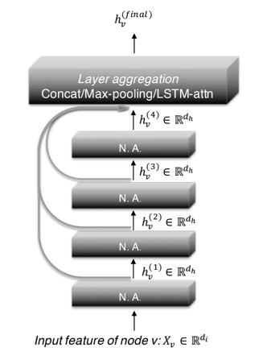

Representation Learning on Graphs with Jumping Knowledge Networks (JK-Net)
============

- Paper link: [https://arxiv.org/abs/1806.03536](https://arxiv.org/abs/1806.03536)
- Author's code repo: [https://github.com/ShinKyuY/Representation_Learning_on_Graphs_with_Jumping_Knowledge_Networks](https://github.com/ShinKyuY/Representation_Learning_on_Graphs_with_Jumping_Knowledge_Networks). Note that the original code is 
implemented with Tensorflow for the paper. 

Structure
-------


How to run
----------
Run with following (available dataset: "cora", "citeseer", "pubmed")
```bash
python jknet_trainer.py --dataset cora 
```
> For details settings, please refer to [here](https://github.com/BUPT-GAMMA/GammaGL/tree/main/examples/gcn#how-to-run).


Results
-------
```bash
TL_BACKEND="paddle" python jknet_trainer.py --dataset cora --mode max --lr 0.01 --n_epoch 170 --hidden_dim 32
TL_BACKEND="paddle" python jknet_trainer.py --dataset citeseer --mode max --lr 0.01 --n_epoch 200 --hidden_dim 64
TL_BACKEND="paddle" python jknet_trainer.py --dataset pubmed --mode cat --lr 0.01 --n_epoch 300 --hidden_dim 64 --itera_K 4
TL_BACKEND="tensorflow" python jknet_trainer.py --dataset cora --mode cat --lr 0.005 --n_epoch 200 --hidden_dim 64
TL_BACKEND="tensorflow" python jknet_trainer.py --dataset citeseer --mode cat --lr 0.01 --n_epoch 170 --hidden_dim 32
TL_BACKEND="tensorflow" python jknet_trainer.py --dataset pubmed --mode max --lr 0.01 --n_epoch 170 --hidden_dim 32
TL_BACKEND="torch" python jknet_trainer.py --dataset cora --mode max --lr 0.01 --n_epoch 200 --hidden_dim 16 
TL_BACKEND="torch" python jknet_trainer.py --dataset citeseer --mode cat --lr 0.01 --n_epoch 200 --hidden_dim 16 
TL_BACKEND="torch" python jknet_trainer.py --dataset pubmed --mode max --lr 0.1 --n_epoch 200 --hidden_dim 16
```
| Dataset | Paper | Our(pd) | Our(tf) | Our(th) |
| ---- | ---- | ---- | ---- | ---- |
| cora | 0.896(±0.005) | 0.847(±0.01) | 0.8584(±0.007) | 0.872(±0.007) |
| citeseer | 0.783(±0.008) | 0.7554(±0.001) | 0.761(±0.01)| 0.769(±0.014)|
| pubmed |  | 0.7782(±0.003) | 0.7826(±0.005) | 0.792(±0.005)| 

