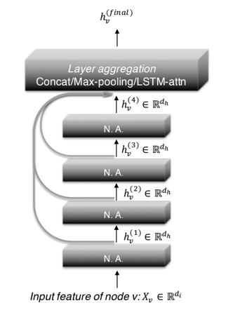

Representation Learning on Graphs with Jumping Knowledge Networks (JK-Net)
============

- Paper link: [https://arxiv.org/abs/1806.03536](https://arxiv.org/abs/1806.03536)
- Author's code repo: [https://github.com/ShinKyuY/Representation_Learning_on_Graphs_with_Jumping_Knowledge_Networks](https://github.com/ShinKyuY/Representation_Learning_on_Graphs_with_Jumping_Knowledge_Networks). Note that the original code is 
implemented with Tensorflow for the paper. 

Structure
-------


How to run
----------
Run with following (available dataset: "cora", "citeseer", "pubmed")
```bash
python jknet_trainer.py --dataset cora 
```
> For details settings, please refer to [here](https://github.com/BUPT-GAMMA/GammaGL/tree/main/examples/gcn#how-to-run).


Results
-------

| Dataset | Paper | Our(pd) | Our(tf) |
| ---- | ---- | ---- | ---- |
| cora | 0.896(±0.005) | 0.847(±0.01) | 0.8584(±0.007) |
| pubmed |  | 0.7782(±0.003) | 0.7826(±0.005) |
| citeseer | 0.783(±0.008) | 0.7554(±0.001) | 0.761(±0.01)|
